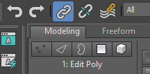

# Bitacora

Bitacora de clase para el curso de Modelado 3D I. Utilizando Software 3DS Max

# Semana 1

Visor: muestra espacio tridimensional

Lado derecho: panel de comandos. Se usa para crear, y modificar.

Arriba: barra de menú (herramientas). Se usa para guardar, abrir, importar, exportar, etc.'

Mas abajo: barra de herramientas. Se usa para crear, modificar, seleccionar, etc.

Ribbon: para modelado poligonal.

Hay elementos que se repiten en el panel de comandos, como por ejemplo: Box.

Izquierda: navagador de la escena. Se usa para organizar los objetos de la escena.

Abajo: barra de animación. Se usa para animar objetos.

Los archivos de 3DS Max se guardan con la extensión .max

Barras punteadas: para agregar elementos a la UI. Hay varios a traves de la UI.

Herramientas de navegación: menu abajo a la derecha, en la esquina.

Cambiar perpsectiva del visor con segundo corchete [Top/Left/Front/Perspective]
Poner fondo de diferente color con cuarto corchete [Default shading]

G: para quitar reticula (maya)

Visor activo: el que tiene el borde amarillo. Para cambiar de visor, click en el visor deseado. Alt + w

Cambiar viewport layout: en la esquina superior izquierda.

Edge faces: default shading + wireframe

F3: para poner wireframe/default shading
F4: para poner edge faces (importante)
Alt + middle click: para orbitar
Middle click: panear
Zoom: scroll del mouse
Z: Zoom extents. Maximiza todo lo que hay en la escena.
Zoom extents all: maximiza en todos los viewport.

Objetos seleccionables: hover y borde en amarillo
Objeto seleccionado: borde en celeste

gizmo de movimiento: las flechas para mover en un eje específico.

Clonar:
Shift + arrastrar: clona el objeto

Para meter referencias:

File -> View image file

Para cambiar color:
Barra de comando -> Name and color -> click en el cuadro de color -> elegir color

Ctrl + click sobre objetos: selección multiple

# Semana 2

Icono mas: crear (objetos primitivos).
- Standard: Box, Sphere, Cylinder, etc.
- Extended: objetos con mas parametros, como por ejemplo: torus, oil tank, etc.

- Son objetos paramétricos: con parametros. Permiten modificar propiedades sin perder la forma original.

Modificar (segundo icono):
- Para modificar objetos base de la parte de crear. Para crear topologías mas complejas.

- Modificación parametrica: se pueden modificar los parametros del objeto sin perder la forma original. Modificaciones de tamaño y estructura.
- Modificación específica: modificación a partir de herramientas (modificadores).
- Modificación poligonal:

- Modifier list: registro de modificadores

Para esferas:
- Hemisphere: para cortar a la mitad
- Slice On:
  - Slice from/to: para cortar un "gajo" de la esfera

Q: select. Si se selecciona varias veces cambia el tipo area seleccionable.
W: select and move
E: select and rotate
R: select and scale (si se apreta varias veces, cambia el tipo de escala: uniforme, no uniforme, etc. Importante para escalar un anillo de forma perfecta.)

Customize -> Units setup

Coordenadas universales u absolutas: Están abajo a la UI. Coordenadas del objeto en base al origen del mundo

Click derecho en Select and move -> Dialogo de coordenadas de movimiento
Absolute: world: coordenadas del objeto en base al origen del mundo
Offset world: para hacer operaciones matemáticas

Snaps de movimiento: para mover objetos con más precisión.
- Shortcut: S
- Click derecho sobre icono de snap.
  - Pestaña de snaps: desactivar grid points. Activar vertex y Midpoint.
  - Pestaña de options: enable axis constraints. Display rubber band (check en ambos).
- Para mover cosas con snap: mover normalmente.
- Para mover sobre varios ejes: hacer click en las direcciones deseadas en el gizmo.

Vertice: punto de unión entre 2 lineas.

Rotaciön: se mide en grados. 360 grados es una vuelta completa.

Snaps de rotación: para rotar objetos con incrementos de X grados.
- Shortcut: A
- Click derecho en snap: options -> angle (cambiar incremento).

- No usar herramienta de escala de momento.

Escala: se mide en porcentaje. 100% es el tamaño original del objeto.

- La herramienta de escala permite hacer un objeto más grande, pero no modifica sus parametros de transformación.

Para agrupar objetos:
- Group -> Group. Para desagrupar: Ungroup.
- Attach: para agregar un objeto a un grupo. Para cuando hace falta.
- Open para abrir un grupo y modificarlo sin desagruparlo. Borde rosado indica lo que está dentro del group.
- Close para cerrar el grupo después de modificarlo. Borde rosado desaparece.

Al copiar:
Copy vs reference:
- Copy: crea una copia del objeto. No tiene relación con el objeto original.
- Reference: crea una copia del objeto. Tiene relación con el objeto original. Si se modifica el objeto original, todas las instancias se verán afectadas. Ejemplo: cambiar tamaño del objeto original, todas las instancias cambiarán de tamaño.

En modifier list:
Box en negrita: significa que es una instancia.

# Modificación especifica:

Se pueden aplicar multiples modificadores a un objeto. Seleccionar nombre del modificador en la lista, notaremos que el borde azul del objeto desaparece. Para salir de este modo, click de nuevo. Se pueden aplicar varios modificadores del mismo tipo o diferentes.

- Click al basurero para eliminar modificador.

FFD: free form deformation. Se marca un gizmo adicional de color naranja.

- FFD 2x2x2: para deformar un objeto con una caja de control con 8 puntos de control.
- FFD 3x3x3: para deformar un objeto con una caja de control con 27 puntos de control.
- FFD 4x4x4: para deformar un objeto con una caja de control con 64 puntos de control.
- FFD (box): matriz variable. Permite cambiar la cantidad de puntos de control.
- FFD (cyl): matriz variable adopta una forma cilindrica en vez de cúbica.

# Semana 3

Para controlar la orientación de los objetos al crearlo, crearlos desde la perspectiva Front.

Tecla 1: activa modificador

Referencia: sistema de calcado. Para usar referencias como en el Blender, crear un plano, y luego en explorador de Windows arrastrar la imagen y dejarla caer sobre el plano. Hay que tener cuidado con las proporciones del plano.
- Usar visores sin perspectiva, importante.
- Alt + x: para poner el objeto a crear en modo de transparencia.

Modelado poligonal:

Tecnica de modelado que emplea el uso de poligonos. Cada parte se conoce como subobjetos.

- Vertices: punto de unión entre 2 o mas lados.
- Segmento (edges): linea que une 2 vertices.
- Poligono: Cualquier extension de superficie que tenga lados y vertices.

Para entrar en modo de modelado poligonal, aplicar modificador Edit Poly, ó abrir menu modeling y marcar casilla de apply edit poly.

Hay 5 niveles de subobjetos:

- Primer icono: vertices (presionar 1)
- Segundo icono: segmentos (presionar 2)
- Tercer icono: borde (presionar 3)
- Cuarto icono: poligono (presionar 4)
- Quinto icono: elemento (presionar 5)

Para salir al modo objeto, click en el icono del modificador Edit Poly o click en el subnivel aplicado.

Metodos de selección:
- Grow
- Shrink
- Loop: (en un segmento de linea, doble click)
- Ring: (en un segmento de linea, Ctrl + doble click)

Se pueden aplicar modificadores a solo una parte de una seleción poligonal. Se pueden aplicar varios edit poly para mayor control y quitar el color rojo de los segmentos.

subdivisión de geometría:

crear más divisiones a partir de geometria existente.

- Swift loop: para crear un nuevo segmento a partir de un segmento existente. Para usarlo, click en el segmento deseado, y luego mover el mouse para elegir la posición del nuevo segmento.
- Cut
- P connect

Extensión de geometría:
- Shift + click (en segmento): crea un poligono a partir de un segmento. Deben ser parte de un borde. Se llama smart extrude.
- Shift + click (en poligono): para extruir un poligono. Se llama smart extrude.
- Extrude: para crear nueva geometría a partir de una selección poligonal. Para usarlo, seleccionar un poligono, click en extrude, y luego mover el mouse para elegir la altura de la extrusión.

Nivel de selección de borde: selecciona los segmentos exteriores de un objeto.

# Semana 4

Los poligonos solo existen en un lado.
- Normal: dirección a la cual el poligono está viendo directamente. Para ver las normales, en el panel de comandos, ir a display -> normals.

Extrusión:
- Para hacer extrusiones mas exactas, se puede dar click en el icono del dropdown del extrude. En este menu flotante, se pueden ingresar valores numéricos para la altura de la extrusión, así como también elegir el tipo de extrusión.

- Extrusiones por normal agrupada
- Extrusiones por normal local
- Extrusiones por polygon

La primera extrusión se hizo con normal local (la extrusión se hace en base a la normal). La segunda extrusión se hizo con polygon (la extrusión se hace respetando la dirección del poligono).

- Extrusión de vertices: también se puede extruir un vértice. Se puede usar para extruir los puntos donde corvengen varios segmentos.
- Extrusión de edges: también se puede extruir un segmento.

Chanfer:

Herramienta para redondear los bordes de un objeto.

- Recomendación es usar profundidad de 0.5 o -0.5.
- Se puede usar para esquinas en vertices y en segmentos.

Bevel:

Similar a una extrusión, pero con la capacidad de escalar el nuevo poligono creado. 

También funciona con:

- Bevel por normal agrupada
- Bevel por normal local
- Bevel por polygon

Inset:

Herramienta para crear un nuevo poligono dentro de un poligono existente.

Attach:

Para meter varias mallas en un solo objeto. Esto hará que se puedan seleccionar por separado a nivel de elemento.

Bridge:

Para crear un "puente" entre dos o mas elementos seleccionados.

Se pueden crear puentes entre:
- Poligonos, segmentos y bordes.

Cap poly:

Para cerrar un agujero en la malla. Se puede usar para cerrar agujeros creados por extrusiones, o para cerrar agujeros creados por eliminar poligonos.
Importante: crea un solo poligono.

Connect:

Para hacer una subdivisión de un poligono, creando un nuevo segmento que conecta dos vertices. Lo hace perpendicular al segmento seleccionado.

Funciona por inclusion y no por rango

Target:

Es como weld (soldadura) pero con la capacidad de elegir un vértice específico al cual hacer el weld. Para usarlo, seleccionar un vértice, click en target, y luego click en el vértice al cual se desea hacer el weld.

Weld:

Dos o más vertices se fusionan en un centro en común. Utiliza un parámetro de tolerancia para determinar qué vértices se fusionan. Empieza a contar desde el centro de la selección. El before y el after muestrán la cantidad de vertices antes y después de la operación de weld.

Geopoly:

Para convertir un objeto paramétrico en un objeto poligonal. Solo funciona en poligonos individuales. Esto es importante para poder modificar la geometría a nivel de subobjetos. Para usarlo, seleccionar el objeto, click derecho, y luego click en convert to -> convert to editable poly.

Para hacerlo en una caja: hacer un inset de varios poligonos -> eliminar los poligonos internos -> seleccionar usando bordes -> cap poly para cerrar el agujero -> seleccionar el poligono creado -> click en geopoly.

Constraints:

Constrain to edge: para mover un vértice a lo largo de un segmento específico.

# Semana 5:

Shapes

Formas bidimensionales. Solo están formados por lineas y vertices. Se llaman splines.

Para acceder, se va al menu del "+", y se selecciona el icono de shapes (segunda opción). Hay varias formas predefinidas, como por ejemplo: line, circle, arc, etc.

Recomendación: para trabajar con shapes, hacerlo solo desde visores isométricos.

Interpolación de vertices: para dividir un segmento y sacar mas vertices "falsos" o internos. Steps en 0 significa que se comportará como un segmento normal, sin vertices internos. Es un paramámetro del shape.

Para usar modificadores, hay que aplicar un edit spline. Solo tienen 3 nivel de subojetos al ser más simples.

Para cambiar tipo de vertice, click derecho en vertice:

Tipos de vertice:

- Corner: vértice normal. No tiene influencia en los segmentos que lo conectan. Solo se modifican a traves de herramientas de transformación.

- Smooth: vértice suave. Produce curvas perfectas.

- Bezier: vértice suave. Tiene puntos de control para modificar la curva. Los puntos de control son proporcionalmente inversos. Importante: Utilizar en puntos medios de una curva.

- Bezier corner: todos los anterior en un mismo tipo de vertice. Permite dar lineas rectas y lineas curvas. Importante: utilizar en extremos una curva o cuando necesitamos que cambie de dirección.

Nota: la interpolación se aplica aunque el vértice sea corner.
Nota 2: si se elimina un vertice, el resto se conectarán sin ese vertice que se eliminó.

Para agregar otro vertice, en las propiedades del shape, ir a geometry -> refine.

Shapes:

- Line: forma básica de shape. Solo tiene segmentos rectos. Haciendo click se crea un vértice. Para cerrar el shape, click en el primer vértice creado. Para crear curvas, hay que dar click y mover el mouse a un punto cercano.

Para retomar un spline sin crear otro nuevo, usar Geometry -> insert.
Para agregar un spline dentro del mismo shape, usar Geometry -> Create line.

----

Modificadores:

- Extrude: solo funciona para splines. Genera extrusiones en base a la forma del spline.
  - Capping funciona para escojer si ambos lados se generan con geometria o no.

Nota: se pueden copiar modificadores entre objetos.

# Semana 6:

Shift + ctrl + eje del gizmo: para hacer copia de algunos poligonos

----

Para alinear objetos en un eje:

Hierarchy -> Adjust pivot -> Move/Rotate/Scale

Affect pivot only: para mover el punto de pivote sin mover el objeto.
- Shortcut: Insert
Reset pivot para devolver el pivote al punto donde estaba cuando se creo el objeto.

Para alinear vertices en un eje:

Edit poly -> seleccionar vertices -> align -> X/Y/Z

----

### Modifier symmetry

para hacer simetría de un objeto. Se puede hacer en cualquier eje. Se puede usar para modelar solo la mitad de un objeto y que el otro lado se genere automáticamente.

----

Splines (herramientas de vertice):

Geometry -> End point auto-welding: es el equivalente a un target. Solo funciona para vertices sin cerrarse.
- Activar automatic welding

Geometry -> Weld: para soldar vertices. Hay que modificar el radio de tolerancia para que funcione, y tener los 2 o más vertices seleccionados.
Geometry -> Connect: equivalente a un bridge. Permite conectar varios vertices

Un vertice de un spline no puede soportar mas de 2 segmentos.

Geometry -> Fillet: para redondear esquinas. Funciona parecido al redondeo de CSS.
Geometry -> Chamfer: para esquinas. Genera un bisel 

Splines (herramientas de spline completo):

Geometry -> Outline: para generar un borde/outline sobre el spline
- Check de Center: para usar el borde como referencia y generar el outline en base a eso.

Geometry -> Boolean:

Se requieren 2 sub-splines

- Union: para unir 2 contornos
- Sustraccion: para quitar 2 contornos
- Intersección: dejar solo la intersección de 2 formas.

Para sacar splines de Illustrator -> guardar en version 8. Pasar a curvas el texto.

### Sweep modifier:

Sweep (barrer, siguiendo una trayectoria). Para crear un volumen a partir de un spline, siguiendo su trayectoria.

Section type:

Use built-in section: para usar formas definidas.
- Tienen parámetros de modificación.

Use custom section:
Section -> Pick (hacer click sobre la forma). Se selecciona por defecto como instance. Si se modifica en la forma custom, afecta también al sweep

Cambio o modificación destructiva: cambios que no tienen manera de revertirlo.

### Chanfer modifier

Funciona como un chanfer normal, pero no aplica como cambio destructivo. También se puede aplicar a edges y polygons especificos.

- Convert to poly: funciona similar a Blender, al aplicar todos los modificadores. Cambio destructivo.

### Taper modifier

Genera un estrechamiento en alguno de los extremos. El taper se aplica en el punto de pivote. Para modificarlo con mas precisión hacer click sobre el taper modifier.

## Semana 7

Para resolver la parte del proyecto que no pude copiar (rellenar), se puede seleccionar la maya que se quiere copiar y darle ctrl + shift + c, y lo mas importante es darle FLIP a las normales del elemento recien creado.

Algo importante de extrusiones es que si se hace una extrusión, en la posición original del poligono no queda otro poligono, sino que queda un agujero.

### Extrude modifier

Para realizar una extrusión no destructiva. Importante agregar segmentos para un bend modifier posterior. El extrude se aplica en el punto de pivote.

### Bend modifier

Para doblar un objeto. Se puede elegir el eje de doblado, y el ángulo de doblado. El bend se aplica en el punto de pivote (para hacer una C habría que poner el punto de pivote en el medio, por ejemplo). Para modificarlo con mas precisión hacer click sobre el bend modifier.

### Lattice modifier

Para hacer un efecto de rejilla. Se puede elegir el eje de la rejilla, y el tamaño de la rejilla.

Geometry:
Apply to Entire Object
Joints Only from vertices -> solo genera esferas en vertices
Structs Only from Edges -> solo genera estructuras en edges (esquinas quedan vacías)
Both -> genera tanto esferas como estructuras

Struts
Radius: tamaño de la estructura

Joints
Radius: tamaño de la estructura

Mantener radius en ambos para hacer una rejilla uniforme.

## Noise modifier

Para hacer generar un efecto de terreno irregular. Se puede elegir el eje de la deformación, y el tamaño de la deformación.
- Scale para cambiar el tamaño de la deformación
- Strength en eje Z

## Shell modifier

Funciona como un extrude de tipo normal local, pero no genera un agujero en el poligono original.

Inner Amount: para hacer un extrude hacia adentro
Outer Amount: lado hacia donde van las normales

Hay que tener cuidado con el shell, debido a que en las esquinas los segmentos diagonales ocupan valores mas largos que los amounts, por lo que hay que seleccionar la opción de "straighten corners" para que las esquinas al final.

## Lathe modifier

Para hacer un objeto 3D a partir de un spline. Para objetos con secciones circulares, como un vaso de vino o una botella. Lo que hace es rotar el spline alrededor de un eje central, generando un objeto 3D.

- Hay que saber el eje de rotación que está aplicando el modificador. Poner en 0 para ver donde está el eje de rotación. Para cambiarlo, seleccionar Lathe e ir a
- Align -> Min: Limite mínimo del spline
- Align -> Center: centro del spline (valor por defecto al crear un spline)
- Align -> Max: Limite máximo del spline

Direction: para cambiar la dirección de rotación del spline. Para objetos acostados.
- Align solo funciona para rotaciones en eje Z, por lo que hay que alinear el eje de rotación para otros ejes manualmente.

- Segmentos: para cambiar la cantidad de segmentos que se generan al rotar el spline

- Weld core: para soldar el eje central del objeto generado. Esto es para limpiar artefactos de geometría que se generan al rotar el spline. Si no se activa, el eje central del objeto generado tendrá algunos agujeros.

- Se puede poner el eje rotación entrnado al modificador, y usar un snap para ponerlo donde debería estar.

## Boolean modifier

Para realizar modificaciones usando operandos. Siempre se debe usar con el Retopology modifier, para que la geometría generada sea limpia y no genere errores de geometría.

- Union: para unir 2 o más objetos. Se puede usar para hacer un objeto mas complejo a partir de 2 objetos simples.
- Subtraction: para restar 2 o más objetos. Se puede usar para hacer un agujero en un objeto a partir de otro objeto.
- Intersection: para dejar solo la intersección de 2 o más objetos. Deja solo el área donde se intersectan los objetos.
- Split: para dividir el objeto en su intersección y dejarlo en otro elemento.

Se pueden aplicar n operandos.

Para editar el objeto original se puede seleccionar el modificador y seleccionar el objeto original, y luego modificarlo. Incluso se puede cambiar el tipo de operando, y el objeto original se mantendrá intacto.

Seleccionar Extract Selected para quitar un objeto como operando.

## Retopología

Proceso para reducir la cantidad de poligonos de un objeto sin perder detalles de la geometría original. 

## Retopology modifier

Modificador para limpiar la geometría de un objeto. Se puede usar para limpiar la geometría de un objeto generado por un booleano, o cualquier maya que no tenga buena integridad. El face count nos permite controlar el nivel de detalle de la geometría generada. Debe ser el menor numero de face count posible sin sacrificar los detalles de la maya original.

## Suavizado de mallas

Integridad: que la maya esté bien conectada, sin agujeros ni errores de geometría.

Para realizar un suavizado de mallas, se ocupa una malla con integridad.

# Semana 8

## Suavizado de mallas

## Turbosmooth modifier

Las iteraciones del suavizado de mallas son muy similares a las interpolaciones de los splines, por lo que si se aplica un turbosmooth en un plano de un solo segmento, se crean 4 segmentos.

Una iteración va a subdividir un poligono en 4 poligonos. Por lo que si se aplica un turbosmooth a un objeto con 100 poligonos, se generarán 400 poligonos.

Usualmente no se ocupan más de 3 iteraciones, hay que tener cuidado con la cantidad de iteraciones, ya que puede generar una cantidad de poligonos muy grande y hacer que el programa se trabe o crashee.

Para poligonos, no hay diferencia entre rings y loops. Si se selecciona un loop desde la UI, se selecciona en ambos sentidos porque lo hace en base a segmentos cercanos, debido a que el programa no sabe a cual dirección ir.

Edit poly:
- Ctrl + click sobre un poligono que esté seleccionado a la par de otro poligono.

Importante: el smooth se aplica sobre los loops.

Existen tres maneras para suavizar una malla con el turbosmooth y darle bordes/filos donde se requiera. La que veremos en el curso será con Smoothing Groups.

## Grupos de suavizado

Se hace desde el nivel de subobjeto de poligono.

Properties al final -> SmGroups

SmGroups: (smoothing groups) para crear grupos de suavizado. Se pueden crear varios grupos de suavizado, y se pueden asignar a los poligonos que se desee.

Por defecto, todos se crean con grupos de suavizado automaticos. Se deben seleccionar todos los poligonos y darle a Clear All. Luego dividir los poligonos en los grupos deseados.

Luego en el modificador de turbo smooth, hay que seleccionar la opción de Separate by -> Smoothing Groups.

Select by SG = para seleccionar todos los poligonos que pertenecen a un grupo de suavizado específico. SG = Smoothing group

## Para instalar Vray

Descargar .zip que pasó el profe, descomprimirlo, y luego abrir el instalador. Seguir el proceso del instalador sin escoger licencia.

Luego, en el zip vienen 2 archivos, un .dlr y otro que es un .dll.

El `vray_73002_fix.dlr` se debe copiar dentro de:
- C:\Program Files\Autodesk\3ds Max 2026\Plugins

El `vray_73002_max_fix.dll` se debe copiar dentro de:
- C:\ProgramData\Autodesk\ApplicationPlugins\VRay3dsMax2026\bin\plugins

## Cámaras

Funcionan igual que una cámara real. Se pueden modificar parámetros como la apertura del lente, la distancia focal, etc.

El target se representan con un cubo. Se puede mover el cubo para cambiar la dirección de la cámara. Si se mueve la cámara, el target siempre se mantiene enfocado en el punto del cubo.

Para agregar una cámara, se ocupa que sea desde un visor de perspectiva.
- Notar que se cambia el nombre del visor a la cámara que se acaba de crear.
- Ctrl + C para crear una cámara con la cámara actual.
- Para crear otra cámara, se debe hacer sin seleccionar ninguna cámara.

Para ver todas las cámaras, se puede con la tecla C.

## Motores de renderizado

Se puede usar para renderizar escenas con iluminación global, materiales avanzados, y efectos de cámara. Como EEVEE y Cycles.

Hay algunos motores nativos que trae el 3DS Max:
- Scanline renderer: motor de renderizado básico. No tiene muchas opciones avanzadas, obsoleto. Pero aún se puede usar para renderizar escenas simples si se ocupara. Se ocupa un poco más de trabajo para obtener buenos resultados.
- Arnold renderer: motor de renderizado avanzado. Anteriormente conocido como MentalRay desde 2017. Tiene muchas opciones avanzadas, pero es más lento que Vray.
- Corona renderer: motor de renderizado avanzado por Render Legion. Es muy efectivo en los tiempos de renderizad.
- Vray renderer: motor de renderizado avanzado por Chaos Group. Es muy efectivo en los tiempos de renderizado.

## Rendering

Para renderizar:

Menu rendering -> Render setup o bien apretar F10, y luego darle click al botón grande que dice Render.
- Shift + Q para renderizar la escena en el visor de renderizado.

Para cambiar motor de renderizado:

Render setup -> Renderer (es un dropdown)
- Vray 7, update 3 DR2 (usar este)
- Vray 7 GPU, update 3 DR2

Para cambiar el tamaño del output, se puede desde Common -> Output Size.

Para guardar archivos, hacerlo desde la vista de renderizado de Vray.

Para habilitar el historial -> Options -> VFB Settings. Este historial se guarda a traves de todos los archivos.

A la derecha hay opciones de post, como exposure y lens effects
- Recomendado activar Lens Effects, dandole click y habilitando el check de Enable Lens Effects.

# Semana 9

# Vinculación jerarquica

Select and link (icono de cadena):

Click en un objeto y arrastrar hacia el siguiente para vincular. El primer objeto es el hijo y el segundo es el padre.

Nota: gizmos de posicionamiento siempre apuntan a los ejes espaciales debido a que el Reference Coordinate System está por defecto en View.
- Cambiar a local

## Iluminación natural

Luz natural: luz del sol

Archive: lo mismo que es un package de Adobe. Guarda las rutas de archivos externos

Agregar objetos -> icono de bombillo

Photometric/Standard: nativas del programa
Standard: Arnold
Vray: luces nuevas

VraySun:

Would you like to automatically add a VraySky environment map? Yes

Sun parameters:

- Intensity multiplier: 0.03 (recomendado)
- Size multiplier: para cambiar intensidad de difuminación en sombras. Entre más alto más difuminado

Cloud parameters:

- Density: controla cantidad de nubes
- Cirrus amount: controla la cantidad de nubes de tipo cirrus (Vray genera otro tipo de nubes por defecto)
- TODO: repasar nombre de nubes por defecto

Entorno/environment: fondo del render

## Luz artificial

Luces como focos.

Distribución: forma en se dispersa la luz.
- Angular
- Omnidireccional

Atenuación: cantidad de luz que se emite

Multiplier: intensidad o fuerza

VrayLight: luces artificiales

### Parametros generales:
- On (check)
- Type (forma de luz)
- Largo y ancho

### Plane/disc light

Utiliza el tamaño de Targeted (por defecto no está checked)

- Directional
- Preview: selected (por defecto en never)

- Generar esquemas de luz a partir de multiples luces. Utilizar intensidades que sean realistas.

### Options
- Invisible (para esconder la fuente de la luz pero no su incidencia en la escena, util para no tener que alinear una fuente luz con un modelo de una lampara por ejemplo). Nota: no oculta las reflecciones.
- Affect reflections: quita la luz de los reflejos, pero deja la incidencia.

Para hacer que un objeto ya no sea una instancia se puede ir al modificador y dar click en make unique.

### Sphere light

El multiplier hay que manejarlo diferente debido a que es una luz omnidireccional, hay que usarla con menos multiplier.

## Mesh light

dar click en icono de vray mesh light (que tiene forma de dado D20)