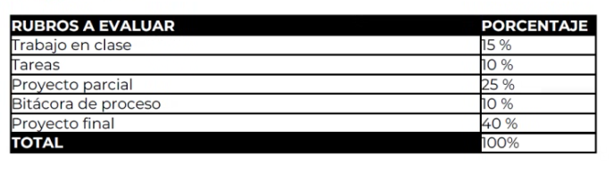

## Rúbrica de clase

**3ds Max**: la interfaz, los visores y cómo moverse por la escena.

## Zonas de la interfaz

| Zona | Ubicación | Para qué sirve |
| --- | --- | --- |
| Visor | Centro | Muestra el espacio tridimensional |
| Panel de comandos | Derecha | Crear y modificar objetos |
| Barra de menú | Arriba | Guardar, abrir, importar, exportar |
| Barra de herramientas | Bajo el menú | Crear, modificar, seleccionar |
| Ribbon | Superior | Modelado poligonal |
| Navegador de escena | Izquierda | Organizar los objetos de la escena |
| Barra de animación | Abajo | Animar objetos |
| Herramientas de navegación | Esquina inferior derecha | Orbitar, panear, zoom |

:::note
Los archivos de 3ds Max se guardan con la extensión `.max`. Algunos elementos/funcionalidades/botones se
repiten entre el panel de comandos y otras zonas (por ejemplo, **Box**).
:::

:::tip[Personalizar la UI]{icon="pencil"}
Las barras punteadas repartidas por la interfaz sirven para agregar elementos a
la UI. Hay varias a lo largo de la ventana.
:::

## Los visores

Cambiar la perspectiva del visor con el **segundo corchete** `[Top/Left/Front/Perspective]`.
Cambiar el fondo con el **cuarto corchete** `[Default shading]`.

- **Visor activo:** el que tiene el borde amarillo. Para cambiarlo, clic sobre el visor deseado.
- **Cambiar el layout de visores:** esquina superior izquierda.
- **Edge faces:** default shading + wireframe.

### Atajos de navegación

| Atajo | Acción |
| --- | --- |
| `Alt + W` | Maximizar / restaurar el visor activo |
| `G` | Quitar la retícula (malla) |
| `F3` | Alternar wireframe / default shading |
| `F4` | Alternar edge faces (importante) |
| `Alt + clic central` | Orbitar |
| `Clic central` | Panear |
| Scroll del mouse | Zoom |
| `Z` | Zoom extents (maximiza lo que hay en la escena) |

:::note
**Zoom extents all** maximiza el contenido en todos los visores a la vez.
:::

## Selección y transformación

- **Objeto seleccionable:** al pasar el cursor, el borde se pone amarillo.
- **Objeto seleccionado:** el borde se pone celeste.
- **Gizmo de movimiento:** las flechas para mover en un eje específico.
- `Ctrl + clic` sobre objetos: selección múltiple.

### Clonar

`Shift + arrastrar` clona el objeto.

## Referencias y color

Meter una imagen de referencia

`File → View image file`

Cambiar el color de un objeto

Barra de comandos → **Name and color** → clic en el cuadro de color → elegir color.

