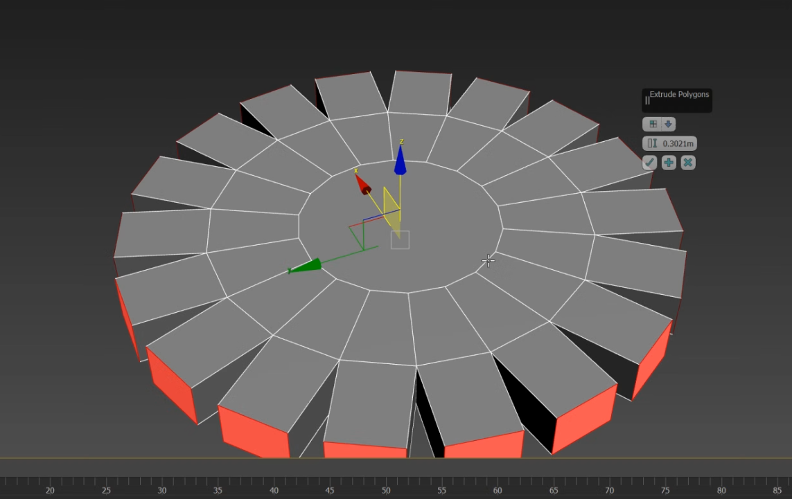

## Normales

Los polígonos solo existen en un lado.

:::note[Normal]
Dirección hacia la que el polígono está viendo directamente. Para ver las
normales: panel de comandos → **Display → Normals**.
:::

## Extrusión

Para extrusiones más exactas, clic en el icono del dropdown de **Extrude**. En
ese menú flotante se ingresan valores numéricos para la altura y se elige el tipo:

- Extrusión por **normal agrupada**
- Extrusión por **normal local**
- Extrusión por **polygon**

:::note[En la imagen]
La primera extrusión se hizo con **normal local** (se extruye según la normal).
La segunda con **polygon** (respetando la dirección del polígono).
:::

También se puede extruir:

- **Vértices:** útil para los puntos donde convergen varios segmentos.
- **Edges (segmentos).**

## Herramientas de edición

### Chamfer

Redondea los bordes de un objeto.

:::tip{icon="pencil"}
Se recomienda usar profundidad de `0.5` o `-0.5`. Funciona en esquinas, tanto en
vértices como en segmentos.
:::

### Bevel

Similar a una extrusión, pero permite escalar el polígono nuevo. Funciona por
normal agrupada, normal local o polygon.

### Inset

Crea un polígono nuevo **dentro** de un polígono existente.

### Attach

Mete varias mallas en un solo objeto. Luego se pueden seleccionar por separado a
nivel de elemento.

### Bridge

Crea un "puente" entre dos o más elementos seleccionados: polígonos, segmentos o bordes.

### Cap poly

Cierra un agujero en la malla (creado por extrusiones o por eliminar polígonos).

:::caution
**Cap poly** crea un solo polígono para cerrar el agujero.
:::

### Connect

Subdivide un polígono creando un segmento nuevo que conecta dos vértices,
perpendicular al segmento seleccionado. Funciona por inclusión, no por rango.

### Target

Como **Weld**, pero eligiendo un vértice específico al cual soldar. Seleccionar
un vértice, clic en target y clic en el vértice destino.

### Weld

Dos o más vértices se fusionan en un centro común. Usa un parámetro de
tolerancia para decidir qué vértices se fusionan, contando desde el centro de la
selección. El *before / after* muestra la cantidad de vértices antes y después.

Geopoly - convertir a objeto poligonal

Convierte un objeto paramétrico en poligonal (solo funciona en polígonos
individuales). Necesario para modificar la geometría a nivel de subobjetos.

Clic derecho → **Convert to → Convert to Editable Poly**.

**En una caja:** inset de varios polígonos → eliminar los polígonos internos →
seleccionar usando bordes → cap poly para cerrar → seleccionar el polígono
creado → clic en geopoly.

## Constraints

**Constrain to edge:** mueve un vértice a lo largo de un segmento específico.
