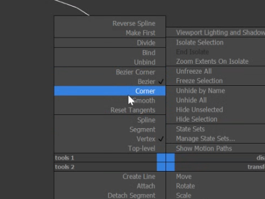

## Shapes

Formas bidimensionales, formadas solo por líneas y vértices. Se llaman **splines**.

Para acceder: menú del **+** → icono de *shapes* (segunda opción). Hay formas
predefinidas: line, circle, arc, etc.

:::tip
Para trabajar con shapes, hacerlo solo desde **visores isométricos**.
:::

:::note[Interpolación de vértices]
Divide un segmento y saca más vértices "falsos" o internos. **Steps = 0** hace
que se comporte como un segmento normal, sin vértices internos. Es un parámetro
del shape.
:::

Para usar modificadores hay que aplicar un **Edit Spline**. Al ser más simples,
los splines solo tienen 3 niveles de subobjetos.

## Tipos de vértice

Clic derecho en un vértice para cambiar su tipo:

| Tipo | Comportamiento |
| --- | --- |
| **Corner** | Vértice normal. No influye en los segmentos; solo se modifica con herramientas de transformación |
| **Smooth** | Vértice suave. Produce curvas perfectas |
| **Bezier** | Suave, con puntos de control (proporcionalmente inversos). Usar en puntos medios de una curva |
| **Bezier corner** | Combina todo lo anterior. Permite líneas rectas y curvas. Usar en extremos de una curva o donde cambie de dirección |

:::note
- La interpolación se aplica aunque el vértice sea *corner*.
- Si se elimina un vértice, el resto se conectan sin ese vértice eliminado.
:::

## Herramienta Line y edición de splines

- **Line:** forma básica de spline. Solo tiene segmentos rectos. Cada clic crea un vértice; para cerrar el shape, clic en el primer vértice. Para curvas, clic y mover el mouse a un punto cercano.

Retomar y agregar splines

- Agregar otro vértice: propiedades del shape → **Geometry → Refine**.
- Retomar un spline sin crear otro nuevo: **Geometry → Insert**.
- Agregar un spline dentro del mismo shape: **Geometry → Create line**.

## Primer modificador de spline

### Extrude

:::note
Solo funciona para splines. Genera extrusiones según la forma del spline.
**Capping** decide si ambos lados se generan con geometría o no.
:::

:::tip
Se pueden copiar modificadores entre objetos.
:::
