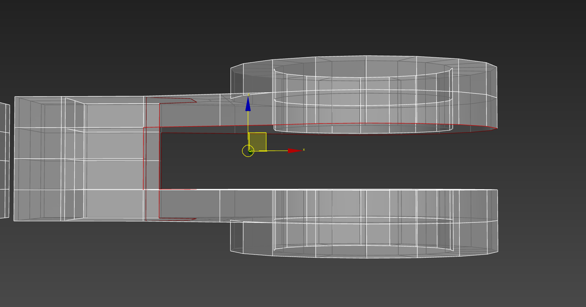

## Trucos de proyecto

:::tip[Rellenar una parte que no se pudo copiar]
Seleccionar la malla a copiar y pulsar `Ctrl + Shift + C`. Lo más importante:
darle **FLIP** a las normales del elemento recién creado.
:::

:::caution
Al hacer una extrusión, en la posición original del polígono **no queda otro
polígono**, sino un agujero.
:::

## Extrude modifier

Extrusión no destructiva. Se aplica en el punto de pivote.

:::note
Importante agregar segmentos para un **bend modifier** posterior.
:::

## Bend modifier

Dobla un objeto. Se elige el eje y el ángulo de doblado. Se aplica en el punto de
pivote.

:::tip
Para hacer una **C**, poner el punto de pivote en el medio. Para más precisión,
clic sobre el bend modifier.
:::

## Lattice modifier

Genera un efecto de rejilla. Se elige el eje y el tamaño.

**Geometry:**

| Opción | Resultado |
| --- | --- |
| Apply to Entire Object | Aplica a todo el objeto |
| Joints Only from Vertices | Solo esferas en los vértices |
| Struts Only from Edges | Solo estructuras en los edges (las esquinas quedan vacías) |
| Both | Esferas y estructuras |

- **Struts → Radius:** tamaño de la estructura.
- **Joints → Radius:** tamaño de la estructura.

:::tip
Mantener el mismo *radius* en ambos para una rejilla uniforme.
:::

## Noise modifier

Genera un efecto de terreno irregular. Se elige el eje y el tamaño de la deformación.

- **Scale:** cambia el tamaño de la deformación.
- **Strength** en eje Z.

## Shell modifier

Funciona como un extrude de tipo normal local, pero **no** genera un agujero en el
polígono original.

- **Inner Amount:** extrude hacia adentro.
- **Outer Amount:** lado hacia donde van las normales.

:::caution
En las esquinas, los segmentos diagonales ocupan valores más largos que los
amounts. Activar **Straighten Corners** para corregirlo.
:::

## Lathe modifier

Crea un objeto 3D a partir de un spline, rotándolo alrededor de un eje central.
Ideal para objetos con secciones circulares (una copa de vino, una botella).

Ajustar el eje de rotación

Hay que saber qué eje aplica el modificador. Poner en `0` para ver dónde está el
eje. Para cambiarlo, seleccionar **Lathe** e ir a:

- **Align → Min:** límite mínimo del spline.
- **Align → Center:** centro del spline (valor por defecto).
- **Align → Max:** límite máximo del spline.

**Direction** cambia la dirección de rotación (para objetos acostados). *Align*
solo funciona para rotaciones en eje Z, así que para otros ejes hay que alinear
el eje manualmente.

- **Segments:** cantidad de segmentos generados al rotar el spline.
- **Weld core:** solda el eje central para limpiar artefactos de geometría. Si no se activa, el eje central tendrá agujeros.
- Se puede posicionar el eje de rotación entrando al modificador y usando un snap.

## Boolean modifier

Modificaciones usando operandos.

:::caution
Usar **siempre** con el **Retopology modifier** para que la geometría generada
sea limpia y no genere errores.
:::

| Operando | Resultado |
| --- | --- |
| Union | Une 2 o más objetos (uno complejo a partir de simples) |
| Subtraction | Resta objetos (agujeros) |
| Intersection | Deja solo la intersección |
| Split | Divide el objeto en su intersección y lo deja como otro elemento |

Se pueden aplicar *n* operandos. Para editar el objeto original, seleccionar el
modificador y luego el objeto original. Incluso se puede cambiar el tipo de
operando manteniendo intacto el original. **Extract Selected** quita un objeto
como operando.

## Retopología

:::note
Proceso para reducir la cantidad de polígonos de un objeto sin perder detalles de
la geometría original.
:::

### Retopology modifier

Limpia la geometría de un objeto (por ejemplo, la generada por un booleano, o
cualquier malla sin buena integridad). El **face count** controla el nivel de
detalle: debe ser el menor posible sin sacrificar los detalles de la malla original.

## Suavizado de mallas

:::note[Integridad]
Que la malla esté bien conectada, sin agujeros ni errores de geometría. Para
suavizar una malla se necesita una malla con integridad.
:::
