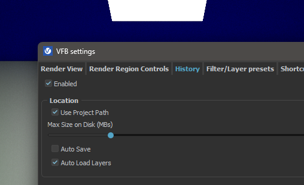

## Turbosmooth modifier

Las iteraciones del suavizado de mallas son muy similares a las interpolaciones
de los splines: si se aplica un turbosmooth en un plano de un solo segmento, se
crean 4 segmentos.

:::note[Cómo crece la geometría]
Una iteración subdivide un polígono en **4 polígonos**. Si se aplica un
turbosmooth a un objeto con 2 polígonos, se generan 8.
:::

:::caution
Usualmente no se ocupan más de **3 iteraciones**. Hay que tener cuidado con la
cantidad, ya que puede generar una cantidad de polígonos muy grande y hacer que
el programa se trabe o crashee.
:::

Para polígonos no hay diferencia entre rings y loops. Si se selecciona un loop
desde la UI, se selecciona en ambos sentidos porque lo hace en base a segmentos
cercanos, debido a que el programa no sabe hacia cuál dirección ir.

**Edit poly:** `Ctrl + clic` sobre un polígono que esté seleccionado a la par de
otro polígono.

:::tip[Importante]
El smooth se aplica sobre los **loops**.
:::

Existen tres maneras de suavizar una malla con el turbosmooth y darle
bordes/filos donde se requiera. La que se ve en el curso es con **Smoothing
Groups**.

## Grupos de suavizado

Se hace desde el nivel de subobjeto de **polígono**.

`Properties (al final) → SmGroups`

:::note[SmGroups]
Smoothing groups: sirven para crear grupos de suavizado. Se pueden crear varios
y asignarlos a los polígonos que se desee.
:::

Por defecto todos se crean con grupos de suavizado automáticos. Se deben
seleccionar todos los polígonos y darle a **Clear All**. Luego se dividen los
polígonos en los grupos deseados.

Después, en el modificador de turbosmooth, hay que seleccionar la opción
**Separate by → Smoothing Groups**.

**Select by SG:** para seleccionar todos los polígonos que pertenecen a un grupo
de suavizado específico. *SG = Smoothing Group.*

## Instalar V-Ray

Proceso de instalación

Descargar el `.zip` que pasó el profe, descomprimirlo y abrir el instalador.
Seguir el proceso del instalador **sin escoger licencia**.

En el zip vienen 2 archivos, un `.dlr` y un `.dll`, que se copian así:

| Archivo | Destino |
| --- | --- |
| `vray_73002_fix.dlr` | `C:\Program Files\Autodesk\3ds Max 2026\Plugins` |
| `vray_73002_max_fix.dll` | `C:\ProgramData\Autodesk\ApplicationPlugins\VRay3dsMax2026\bin\plugins` |

## Cámaras

Funcionan igual que una cámara real. Se pueden modificar parámetros como la
apertura del lente, la distancia focal, etc.

El **target** se representa con un cubo. Se puede mover el cubo para cambiar la
dirección de la cámara. Si se mueve la cámara, el target siempre se mantiene
enfocado en el punto del cubo.

Para agregar una cámara se ocupa hacerlo desde un **visor de perspectiva**.

- Notar que se cambia el nombre del visor a la cámara que se acaba de crear.
- Para crear otra cámara, se debe hacer sin seleccionar ninguna cámara.

| Atajo | Acción |
| --- | --- |
| `Ctrl + C` | Crear una cámara con la cámara actual |
| `C` | Ver todas las cámaras |

## Motores de renderizado

Se pueden usar para renderizar escenas con iluminación global, materiales
avanzados y efectos de cámara. Como EEVEE y Cycles de Blender.

Algunos motores nativos que trae 3ds Max:

| Motor | Características |
| --- | --- |
| **Scanline renderer** | Motor básico. No tiene muchas opciones avanzadas, obsoleto. Aún sirve para escenas simples, pero se ocupa más trabajo para obtener buenos resultados |
| **Arnold renderer** | Motor avanzado. Anteriormente conocido como MentalRay desde 2017. Tiene muchas opciones avanzadas, pero es más lento que V-Ray |
| **Corona renderer** | Motor avanzado, por Render Legion. Muy efectivo en los tiempos de renderizado |
| **V-Ray renderer** | Motor avanzado, por Chaos Group. Muy efectivo en los tiempos de renderizado |

## Rendering

Para renderizar: `Menú Rendering → Render setup` (o `F10`), y luego clic en el
botón grande que dice **Render**.

| Atajo | Acción |
| --- | --- |
| `F10` | Abrir Render setup |
| `Shift + Q` | Renderizar la escena en el visor de renderizado |

### Cambiar el motor de renderizado

`Render setup → Renderer` (es un dropdown):

- **V-Ray 7, update 3 DR2** [usar este].
- V-Ray 7 GPU, update 3 DR2 [preguntar si se puede renderizar por GPU].

### Ajustes de salida

- **Tamaño del output:** `Common → Output Size`.
- **Guardar archivos:** hacerlo desde la vista de renderizado de V-Ray.
- **Habilitar el historial:** `Options → VFB Settings`. Este historial se guarda a través de todos los archivos.

A la derecha hay opciones de post, como **exposure** y **lens effects**.